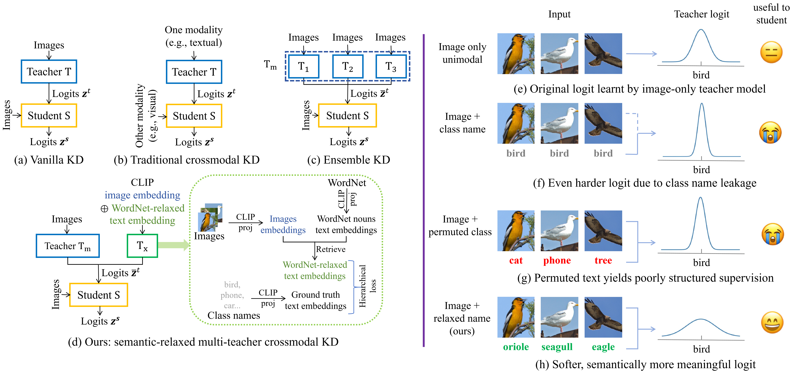
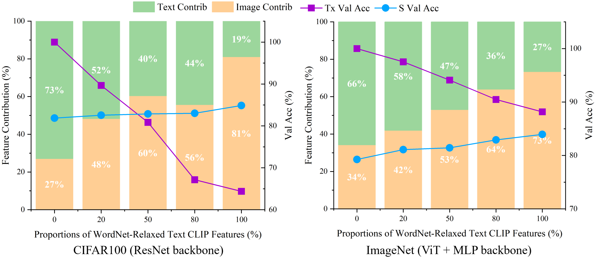
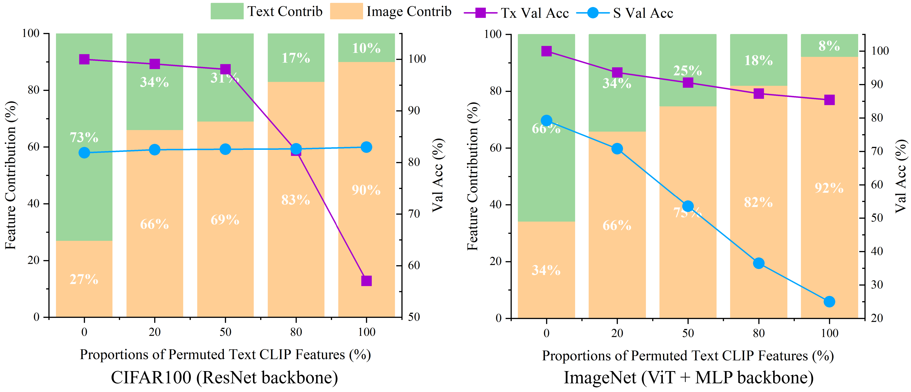

# Crossmodal Knowledge Distillation with WordNet-Relaxed Text Embeddings

> **How can a multimodal teacher use text during training without letting exact class names become a shortcut?**

[](https://arxiv.org/abs/2503.24017)
[](#)
[](https://github.com/openai/CLIP)
[](https://wordnet.princeton.edu/)

Official project repository for:

**[Crossmodal Knowledge Distillation with WordNet-Relaxed Text Embeddings for Robust Image Classification](https://arxiv.org/abs/2503.24017)**  
Chenqi Guo, Mengshuo Rong, Qianli Feng, Rongfan Feng, Yinglong Ma

---

## TL;DR

Crossmodal knowledge distillation (KD) can use a multimodal teacher during training while keeping the deployed student **image-only**. However, directly feeding the teacher an image together with its **exact class name** creates a shortcut: the teacher can recover the label from text, produce overconfident / near one-hot logits, and leave little useful "dark knowledge" for the student.

We address this with **semantic relaxation**:

- replace exact class-name prompts with **semantically related WordNet nouns**;
- align candidate nouns with the dataset's visual distribution using **CLIP image features + K-means**;
- make the selected text embeddings **learnable**, while constraining them with hierarchical and cosine losses;
- combine the relaxed multimodal teacher with a complementary image-only teacher ensemble using **inverse-loss weighting**;
- distill everything into a standard **image-only student at inference time**.

The key observation is counter-intuitive but important:

> **A teacher with higher classification accuracy is not necessarily a better distillation teacher.**  
> Exact class-name prompts can make the teacher nearly perfect while making its supervision less transferable; WordNet relaxation lowers teacher confidence, increases logit entropy, and improves student accuracy.

---

## Motivation

<p align="center">
  
</p>

The figure summarizes the core problem and solution:

1. **Vanilla KD** transfers knowledge from one image teacher to an image student.
2. **Conventional crossmodal KD** introduces another modality, but modality-specific information is not always transferable to an image-only student.
3. **Ensemble KD** strengthens supervision through multiple visual teachers but remains unimodal.
4. **Our framework** combines a visual teacher ensemble with a multimodal CLIP-based teacher whose text branch uses **WordNet-relaxed semantics instead of exact class names**.

On the right side of the figure, exact class-name prompts create very sharp logits because the text itself exposes the answer. Randomly permuting class names removes the direct token match but also destroys semantic structure. WordNet-relaxed prompts instead preserve a meaningful semantic neighborhood, producing softer and more useful teacher targets.

---

## Why Exact Class Names Can Hurt KD

Suppose the image belongs to the class `bird`.

A conventional multimodal teacher may receive both:

```text
image: <bird image>
text : "bird"
```

This makes the label easy to infer directly from text. The teacher can become extremely accurate, but its output distribution collapses toward a one-hot vector.

For distillation, that is undesirable because the student learns not only from the correct class, but also from the **relative probabilities among non-target classes**. These soft relationships are part of the knowledge that KD is intended to transfer.

Our alternative replaces the exact label token with semantically related terms such as:

```text
bird -> oriole, seagull, eagle, ...
```

or, for another example discussed in the manuscript:

```text
phone -> desk phone, telephone booth, cellphone, telephone, ...
```

The teacher still receives class-relevant semantics, but no longer gets a trivial one-to-one label token.

---

## Method Overview

### 1. Complementary Teachers

We use two teacher families:

- **Unimodal teacher** `T_m`: an ensemble of image classifiers trained with diverse augmentation policies.
- **Multimodal teacher** `T_x`: a classifier built from **CLIP image embeddings** concatenated with **WordNet-relaxed CLIP text embeddings**.

The student `S` is trained from scratch and remains purely visual.

### 2. WordNet-Relaxed Text Embeddings

For each class, we retrieve semantically related WordNet nouns, including synonyms and related hypernym / hyponym concepts.

The relaxation pipeline is:

```text
Class labels
    |
    v
WordNet noun candidates
    |
    v
CLIP text encoding with prompt templates
    |
    +---------------------------+
    |                           |
    |                    Training images
    |                           |
    |                           v
    |                   CLIP image features
    |                           |
    |                           v
    |                       K-means
    |                           |
    +------ image-aware semantic alignment
                |
                v
       Selected relaxed nouns
                |
                v
      Learnable text embeddings
```

Candidate noun embeddings are aligned with clusters of CLIP image embeddings, and the best-matching candidates are retained. The selected noun embeddings are then optimized as learnable parameters during multimodal-teacher training.

### 3. Semantic Constraints

To prevent the relaxed embeddings from drifting too far from their intended meaning, we use two constraints.

The **hierarchical loss** keeps a relaxed embedding semantically close to its ground-truth class descriptor:

$$
\mathcal{L}_{\mathrm{hier}}
=
1-\cos\left(\mathbf{n}_{\mathrm{gt}},\mathbf{n}_{\mathrm{relaxed}}\right).
$$

The **cosine regularization** keeps it close to its pretrained WordNet-based initialization:

$$
\mathcal{L}_{\mathrm{cosreg}}
=
1-\cos\left(\mathbf{n}_{\mathrm{pretrained}},\mathbf{n}_{\mathrm{relaxed}}\right).
$$

The multimodal teacher is trained with:

$$
\mathcal{L}_{T_x}
=
\mathcal{L}_{\mathrm{sup}}
+
\lambda_{\mathrm{hier}}\mathcal{L}_{\mathrm{hier}}
+
\lambda_{\mathrm{cosreg}}\mathcal{L}_{\mathrm{cosreg}}.
$$

### 4. Adaptive Multi-Teacher Integration

Rather than averaging teachers uniformly, we maintain an exponential moving average of each teacher's recent KD loss and assign larger weights to teachers that currently provide more compatible supervision:

$$
w^{(k)}
=
\frac{1/(\ell^{(k)}+\epsilon)}
{\sum_j 1/(\ell^{(j)}+\epsilon)},
\qquad
\overline{\mathbf{z}}^{t}
=
\sum_k w^{(k)}\mathbf{z}^{t(k)}.
$$

This helps prevent the student from over-relying on a superficially accurate but poorly transferable teacher.

### 5. Image-Only Deployment

Text and CLIP semantics are used **only to construct teacher supervision during training**.

At deployment:

```text
image -> student -> prediction
```

No text prompt, WordNet lookup, or multimodal input is required.

---

## Main Contributions

1. **Diagnosing label leakage in supervised crossmodal KD.**  
   We show that exact class-name prompts can create shortcut learning in the multimodal teacher, causing low-entropy / near one-hot logits and weaker knowledge transfer.

2. **Structured semantic relaxation with WordNet.**  
   Exact label tokens are replaced with class-relevant WordNet noun neighborhoods, preserving semantics without exposing a trivial label shortcut.

3. **Image-aware and learnable textual supervision.**  
   WordNet candidates are filtered using CLIP image-feature alignment and then optimized as learnable embeddings with semantic constraints.

4. **Adaptive multi-teacher distillation.**  
   The relaxed multimodal teacher is combined with a visual-only teacher ensemble through inverse-loss weighting.

5. **Robust image-only students.**  
   Improvements are observed across balanced and long-tailed datasets and across ResNet- and ViT-based settings, while inference remains unimodal.

---

## A Key Finding: Better Teacher Accuracy != Better Distillation

The following examples from the latest manuscript illustrate the central effect.

| Dataset / setting | Text prompt | Teacher entropy ↑ | Teacher `T_x` acc. | Multi-teacher student acc. |
|---|---|---:|---:|---:|
| CIFAR100 / ResNet | Exact class name | 0.0016 | **100.00** | 81.88 |
| CIFAR100 / ResNet | **100% WordNet-relaxed** | **1.2803** | 64.39 | **84.88** |
| ImageNet / ViT + MLP | Exact class name | 0.1865 | **100.00** | 79.25 |
| ImageNet / ViT + MLP | **100% WordNet-relaxed** | **0.8177** | 88.16 | **83.94** |

Despite substantially lower teacher top-1 accuracy, the fully relaxed WordNet teacher produces **higher-entropy, more informative logits** and yields a stronger student.

This is one of the main messages of the project: **teacher confidence and teacher transferability are not the same thing**.

---

## Quantitative Results

We evaluate on six classification benchmarks:

- ImageNet
- ImageNet-LT
- CIFAR100
- CIFAR100-imb100
- Scene
- UTKFace

### ResNet setting

The visual-only multi-teacher baseline uses `T_m -> S`; our full model adds the WordNet-relaxed multimodal teacher.

| Dataset | Visual-only ensemble `T_m S` | Ours `T_m T_x S` | Improvement |
|---|---:|---:|---:|
| ImageNet | 68.95 | **71.01** | **+2.06** |
| ImageNet-LT | 49.65 | **51.21** | **+1.56** |
| CIFAR100 | 82.24 | **84.88** | **+2.64** |
| CIFAR100-imb100 | 52.87 | **54.02** | **+1.15** |
| Scene | 92.13 | **94.25** | **+2.12** |
| UTKFace | 85.24 | **87.76** | **+2.52** |

Average gain over the corresponding visual-only ensemble: **+2.01 percentage points**.

### ViT + MLP setting

| Dataset | Visual-only ensemble `T_m S` | Ours `T_m T_x S` | Improvement |
|---|---:|---:|---:|
| ImageNet | 81.63 | **83.94** | **+2.31** |
| ImageNet-LT | 53.14 | **55.10** | **+1.96** |
| CIFAR100 | 59.18 | **63.17** | **+3.99** |
| CIFAR100-imb100 | 49.95 | **52.94** | **+2.99** |
| Scene | 87.50 | **89.97** | **+2.47** |
| UTKFace | 80.16 | **82.82** | **+2.66** |

Average gain over the corresponding visual-only ensemble: **+2.73 percentage points**.

---

## Interpretability: What Changes as Text Is Relaxed?

<p align="center">
  
</p>

Captum attribution reveals a consistent shift as the proportion of WordNet-relaxed text embeddings increases:

- contribution from the **exact textual shortcut decreases**;
- contribution from **visual features increases**;
- multimodal-teacher accuracy may decrease;
- **student accuracy increases**.

This supports the hypothesis that WordNet-relaxed text acts as a **semantic regularizer** rather than a direct label channel. It still contributes useful class structure, but forces the teacher to ground its predictions more strongly in the image.

### Why not simply randomize the text?

Randomly permuting class-name prompts can also weaken the exact label shortcut, but it destroys semantic coherence.

<p align="center">
  
</p>

In particular, the ImageNet experiments show that as permuted text increasingly dominates, the student can degrade severely. This indicates that **removing label leakage is necessary but not sufficient**: the replacement text must preserve meaningful semantic structure.

---

## WordNet vs. LLM-Generated Relaxation

The latest manuscript also studies LLM-generated candidate nouns as a controlled alternative.

To make the comparison fair, LLM-generated candidates use the same downstream pipeline as WordNet candidates:

```text
candidate generation
    -> CLIP text encoding
    -> image-aware K-means alignment
    -> filtering / selection
    -> learnable embedding optimization
```

Under this matched pipeline, WordNet relaxation is more stable and produces stronger student performance. The analysis suggests that unconstrained LLM vocabularies can introduce more cross-class ambiguity and weaker lexical hierarchy, whereas WordNet provides an explicit, reproducible semantic graph.

The point is not that LLMs cannot provide useful semantics, but that **structured semantic neighborhoods matter for distillation**.

---

## Experimental Setup

### Teacher / Student Configurations

| Component | ResNet setting | Transformer setting |
|---|---|---|
| Unimodal teacher `T_m` | ResNet50 ensemble | ViT-B/16 ensemble |
| Multimodal teacher `T_x` | ResNet50 on CLIP image + text embeddings | 2-layer MLP on CLIP image + text embeddings |
| Student `S` | ResNet18 | ViT-B/32 |
| Inference modality | Image only | Image only |

The visual teacher ensemble uses complementary strong / weak augmentation policies. The student is trained with strong augmentation.

### Benchmarks

The evaluation covers both balanced and long-tailed recognition:

```text
ImageNet            large-scale generic recognition
ImageNet-LT         long-tailed ImageNet
CIFAR100            balanced 100-class recognition
CIFAR100-imb100     strongly imbalanced CIFAR100
Scene               scene recognition
UTKFace             attribute-based face classification
```

---

## Code Structure

The source code is organized around three experiment tracks: the **naive crossmodal baseline**, the **WordNet-relaxed method**, and the **LLM-relaxed comparison**.

```text
CrossmodalKD/
├── data_loader/
│   ├── DataLoaderCIFAR.py
│   ├── DataLoaderImageNet.py
│   ├── DataLoaderInaturalist.py
│   ├── DataLoaderScene.py
│   └── DataLoaderUTKFace.py
├── script/
│   ├── script_forESWA_naiveV1.sh
│   ├── script_cifar100_regularizerV2.sh
│   ├── script_forESWA_LLMrelaxed.sh
│   ├── script_compute_CCO.sh
│   ├── script_compute_MSR.sh
│   └── ...
├── CCO/                         # cross-class-overlap resources/results
├── MSR/                         # semantic-relation resources/results
├── prompt_for_LLM-relaxed/
│   └── Prompt_template.txt
├── TACmodels.py                 # CLIP / teacher-side model components
├── mainCLIPKD_naiveV1.py        # naive image / exact-text baselines
├── trainer_naiveV1.py
├── mainCLIPKD_regularizerV2.py  # WordNet-relaxed ResNet experiments
├── trainer_regularizerV2.py
├── mainCLIPKD_ViT_regularizerV2.py
├── trainer_ViT_regularizerV2.py
├── mainCLIPKD_regularizerLLMV3.py
├── trainer_regularizerLLMV3.py
├── precompute_CLIP_image_embeddings.py
├── WordNet_selected_nouns_CIFAR100.py
├── compute_teacherLogits_entropy_CIFAR.py
├── compute_teacherLogits_entropy_ImageNet.py
├── Captum_Analyze_Image_Text_CIFAR.py
├── Captum_Analyze_Image_Text_ImageNet.py
├── compute_cross_class_overlap.py
├── compute_msr_wn.py
├── compute_msr_llm.py
└── compute_text_semanticSim.py
```

### What the main files do

| File / directory | Role |
|---|---|
| `mainCLIPKD_naiveV1.py` + `trainer_naiveV1.py` | Baseline teacher training and student distillation, including image-only CLIP features and exact class-name text features |
| `mainCLIPKD_regularizerV2.py` + `trainer_regularizerV2.py` | Core WordNet-relaxed multimodal teacher and KD pipeline |
| `mainCLIPKD_ViT_regularizerV2.py` | Transformer / MLP teacher-student experiments |
| `mainCLIPKD_regularizerLLMV3.py` | LLM-generated semantic-relaxation comparison used in the extended experiments |
| `data_loader/` | Dataset loaders for CIFAR100, ImageNet / ImageNet-LT, iNaturalist, Scene, and UTKFace |
| `script/` | Dataset-specific training, distillation, CCO, and MSR experiment commands |
| `CCO/`, `MSR/` | Class-name files, selected semantic terms, and analysis outputs for semantic-overlap studies |
| `Captum_Analyze_Image_Text_*.py` | Image/text attribution analysis |
| `compute_teacherLogits_entropy_*.py` | Teacher-logit entropy analysis used to study label leakage |

---

## Running the Code

> **Research-code note:** the released code preserves the paths, checkpoints, GPU IDs, and experiment settings used in the original research environment. Before running it on another machine, update the dataset paths and checkpoint paths in the corresponding `mainCLIPKD_*.py` files and shell scripts.

The experiment scripts in `script/` are the best reference for the settings used in the paper. Below are representative CIFAR100 commands.

### 1. Train the naive image-only / exact-text baselines

The baseline experiments are implemented in `mainCLIPKD_naiveV1.py`. For example, an image-feature teacher can be trained with:

```bash
CUDA_VISIBLE_DEVICES=0 python mainCLIPKD_naiveV1.py \
  --mode train \
  --arch resnet50 \
  --dataset CIFAR100 \
  --epochs 61 \
  --lr_steps 25 40 60 \
  --batch_size 128 \
  --train_add_strong \
  --useWhatModal image \
  --add_name get_Ts_imageCLIP
```

To train the multimodal baseline with the **exact class name** as text input, switch the modal setting to:

```bash
--useWhatModal image_textGT
```

This is the setting used to expose the label-leakage problem discussed in the paper.

### 2. Train the WordNet-relaxed multimodal teacher

The core WordNet-relaxed implementation is in `mainCLIPKD_regularizerV2.py` and `trainer_regularizerV2.py`:

```bash
CUDA_VISIBLE_DEVICES=0 python mainCLIPKD_regularizerV2.py \
  --mode train \
  --arch resnet50 \
  --dataset CIFAR100 \
  --epochs 61 \
  --lr_steps 25 40 60 \
  --batch_size 128 \
  --train_add_strong \
  --useWhatModal image_textWordNet \
  --add_name get_Ts_image_textWordNet_V2
```

During training, the relaxed text embeddings are retrieved using CLIP image-text similarity and optimized jointly with the teacher. The trainer also applies the hierarchical semantic loss and cosine regularization described above.

### 3. Distill the image-only student

A representative three-teacher CIFAR100 run is:

```bash
CUDA_VISIBLE_DEVICES=2 python mainCLIPKD_regularizerV2.py \
  --mode distil \
  --arch resnet18 \
  --dataset CIFAR100 \
  --teacher_num 3 \
  --epochs 500 \
  --temp 3.0 \
  --alpha 0.6 \
  --lr_steps 300 400 0 \
  --T1_add_strong \
  --T1_add_weak \
  --T4_add_strong_imgCATwordnet \
  --S_add_strong \
  --add_name T1s_T1w_T4sImgCATwordnetV2_Ss
```

The student itself remains a standard visual classifier; WordNet and CLIP text information are only used on the teacher side during training.

### 4. Reproduce the LLM-relaxed comparison

The extended manuscript also compares WordNet against LLM-generated related terms. The corresponding implementation is provided in:

```text
mainCLIPKD_regularizerLLMV3.py
trainer_regularizerLLMV3.py
prompt_for_LLM-relaxed/Prompt_template.txt
script/script_forESWA_LLMrelaxed.sh
```

`build_llm_relaxed_vocab.py` merges and validates LLM-generated candidate batches before the downstream CLIP filtering / training pipeline.

### 5. Semantic-overlap analysis

The repository also includes the analysis code used to compare structured WordNet neighborhoods with LLM-generated vocabularies. Representative scripts are:

```bash
bash script/script_compute_CCO.sh
bash script/script_compute_MSR.sh
```

These scripts call the WordNet- and LLM-specific CCO / MSR utilities and save the corresponding statistics under `CCO/` and `MSR/`. Some LLM-analysis commands still contain original absolute paths and should be edited before reuse.

---

## Reproduction Notes

- Dataset loaders are provided for **CIFAR100, ImageNet / ImageNet-LT, iNaturalist, Scene, and UTKFace**.
- The code supports both **ResNet** and **ViT / MLP** teacher-student configurations used in the experiments.
- Several files intentionally retain the original research-machine paths such as `/home/ps/scratch/...`; replace them with local paths before running.
- Teacher checkpoint paths are configured inside the main training scripts and must match the checkpoints produced in the teacher-training stage before student distillation.
- The repository currently does not include a frozen `requirements.txt` or environment file, so exact package versions should be documented if strict reproduction is required.

---

## Paper

**[Crossmodal Knowledge Distillation with WordNet-Relaxed Text Embeddings for Robust Image Classification](https://arxiv.org/abs/2503.24017)**  
Chenqi Guo, Mengshuo Rong, Qianli Feng, Rongfan Feng, Yinglong Ma

📄 **arXiv:** [2503.24017](https://arxiv.org/abs/2503.24017)

If you find this project useful, please consider citing:

```bibtex
@article{guo2025crossmodalkd,
  title={Crossmodal Knowledge Distillation with WordNet-Relaxed Text Embeddings for Robust Image Classification},
  author={Guo, Chenqi and Rong, Mengshuo and Feng, Qianli and Feng, Rongfan and Ma, Yinglong},
  journal={arXiv preprint arXiv:2503.24017},
  year={2025}
}
```

---

## Takeaway

The central lesson of this project is simple:

> **For crossmodal knowledge distillation, adding text is not enough. The textual signal must be structured so that it contributes semantics without revealing the answer.**

WordNet-relaxed prompts provide such a middle ground: they weaken exact label-token shortcuts, preserve meaningful semantic neighborhoods, increase the informativeness of teacher logits, and improve the final image-only student.
